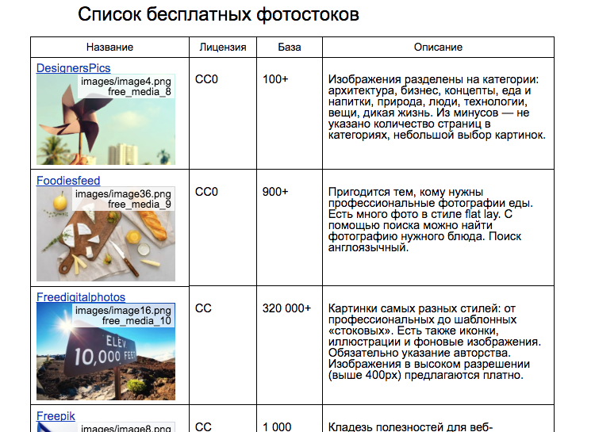

# 📑 Инструмент для понимания порядка картинок в html-формате Google Docs

> [!TIP]
> Новый [скрипт на Apps Scrip для вёрстки статей из Google Docs](https://sglazov.ru/notes/google-docs-to-html/) в чистый HTML c картинками для WordPress:
> 
> **Описание и покупка**: https://sglazov.ru/notes/google-docs-to-html/ \
> **Документация**: https://sglazov.ru/notes/google-docs-to-html/readme/

## Как использовать?

1. Сохранить документ через меню «Файл» → «Скачать как» → «Веб-страница (HTML, ZIP-архив)»;
1. В теле сохраненённого html-документа перед тегом `</body>` подключить два скрипта и определить корректное название картинок в переменной `imgName`:

   ```html
   <script>
     var imgName = 'new_image_item';
   </script>
   <script src="https://sglazov.github.io/google-docs-images/dist/google-docs-images.min.js"></script>
   ```
1. Обновить html-страницу.
1. Вручную псереименовывать картинки в папке `/images`.

В консоле браузера дублируется информация по каждой картинке.

## Демо: как выглядит в браузере



## Ещё на эту тему 🔥 🔥 🔥 🔥 🔥

- [Google Doc to clean HTML converter](https://github.com/oazabir/GoogleDoc2Html);

  Эта штука работает через встренный редактор скриптов в Google Docs.
  Сложна в подключении и настройке. Но умеет присылать картинки в хронологическом порядке на почту.

## Что дальше-то?

- [x] [Гист-файл](https://gist.github.com/sglazov/441700b964e85bbca1c3d50f53887b79) превратить в полноценный репо. Создать один js-файл, который сможет всё;
- [x] Переписать без jQuery, ванильненько;
- [x] Отдавать минифицированную версию JS;
- [x] Вытащить параметр нового имени картинки в отдельный тег при подюкючении;
- [x] Унифицировать классы и имена переменных, чтобы не пересекаться ни с чем;
- [ ] Рассказать в README историю полную боли;
- [ ] Скриптом сохранять картинки с правильным порядковым номером в суффиксе и именем из перменной;
